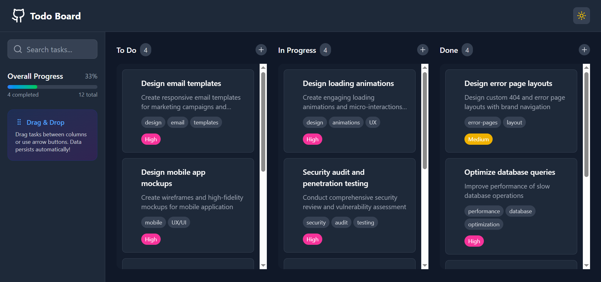

# Todo Board




A modern Kanban-style todo application built with React, Vite, and Tailwind CSS.

## Features

- Add, move, and delete tasks across "To Do", "In Progress", and "Done" columns
- Drag & drop tasks between columns with smooth animations
- Search tasks by title, description, or tags
- Set task priority and tags
- Light/Dark mode toggle with persistent preference
- Data persists automatically in your browser

## Getting Started

### Install dependencies

```sh
npm install
# or
bun install
```

### Spawn development server

```sh
npm run dev
# or 
bun run dev
```

### Build for production

```sh
npm run build
# or
bun run build
```

### Preview the production build

```sh
npm run preview
# or
bun run preview
```

## Project Structure

```
.
├── bun.lock
├── eslint.config.js
├── index.html
├── node_modules
├── package.json
├── public
├── README.md
├── src
└── vite.config.js
```

## Tech Stack

- [React](https://react.dev/)
- [Vite](https://vitejs.dev/)
- [Tailwind CSS](https://tailwindcss.com/)
- [Lucide React Icons](https://lucide.dev/)
